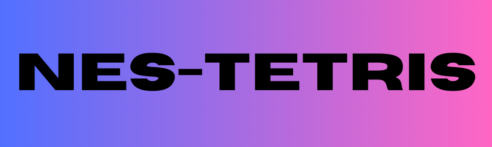

    

  

# NES-Tetris

This project is a copy of original Tetris game that was published on NES console. It copies original scoring system and movement types preserving the retro style.

## Dependencies
* [SFML](https://github.com/SFML/SFML) - simple graphics library for managing windows, handling input and rendering
* [Premake5](https://github.com/premake) - build system

## How to build?
* Create solution file (the only tested version is VS2022)
  * If you have downloaded or compile premake5.exe place it in the project directory and run `.\premake5.exe vs2022`
  * If you have added premake5 to the system path run `premake5 vs2022`
* Open the solution file
* Pick configuration right for You
* Build solution
* Run the program

## Common issues
* The project is configured for static linking. If you have problems with linking make sure that You use files compiled for static linking ([SFML](https://github.com/SFML/SFML) also supports dynamic linking).
* Problems with linking may be caused wrong paths to library and header files. Make sure that You keep the same paths that are listed in premake5.lua file.

## Contributing
Thank you for considering contributing to this project. I am accepting pull requests.
If you have any suggestions, bug reports, or feature requests, feel free to open an issue on GitHub.

